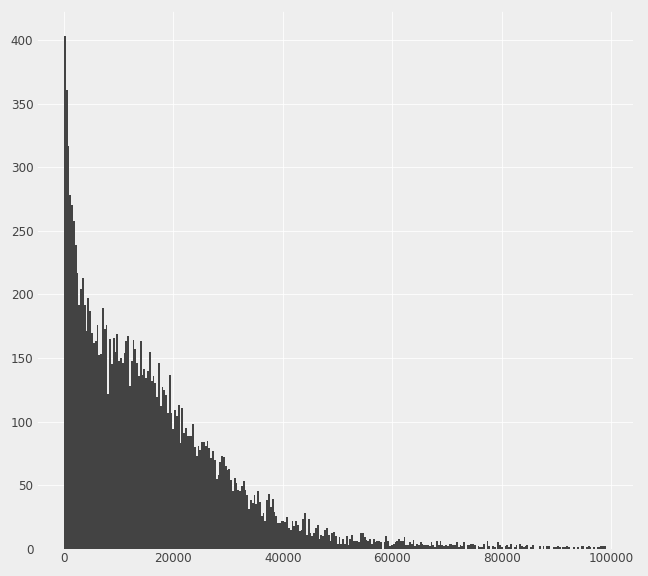
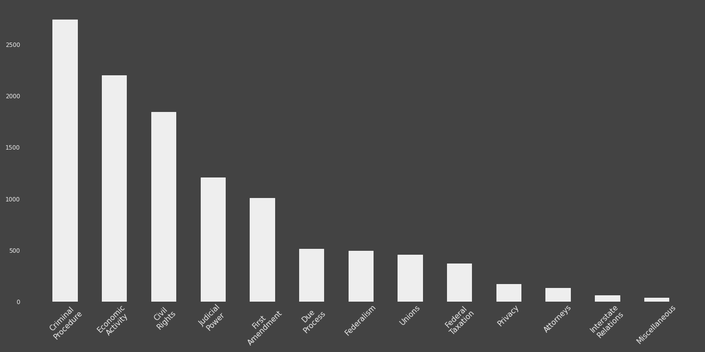
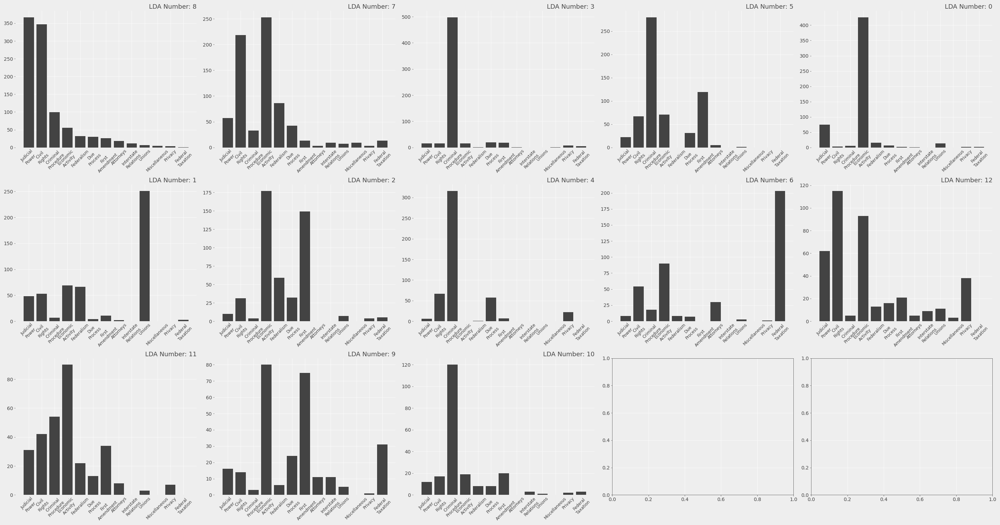
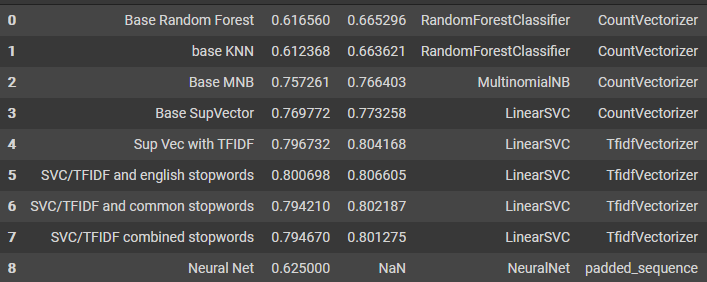
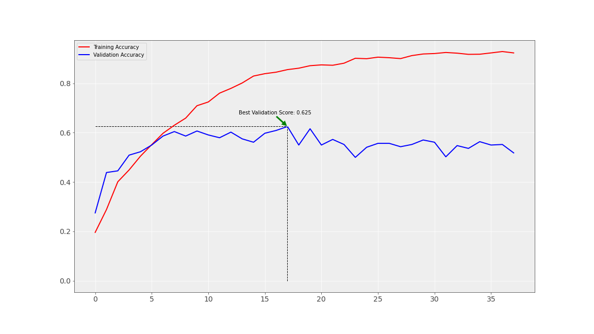

# __Introduction__
 
The purpose of this project is the develop a model that can accuratly classify supreme court
opinions into areas of law. The model will be able to predict one of about a dozen classes for every full opinion text passed into it. 

### __<ins> NOTE: The data used in this project is not present in the repo and must be downloaded seperately.__

- Please see "Data Sources" section below
 
# __Repository structure__
 
This Repository consists of the following files and directories:
 
1. __<ins>SupremeCourtOpinionAnalysis.ipynb:__

    The meat and potatoes: contains the analysis and modeling
 
2. __<ins>datashop_classes.py:__

    Contains some custom classes used in the main notebook.   
    Datashop is the name of a pypi package I maintain where I keep handy functions and classes. I have kept these particular classes within this repository to make it easier to inspect them. 
 
3. __<ins>Presentation.pdf:__

    A PDF of the slideshow used during the video presentation of this project. A link to the video can be found [here.](https://youtu.be/5wYKz0c8Lms)
 
4. __<ins>images/:__
 
    This stores the images of charts from the notebook. 
 
5. __<ins>data/:__

    This is the folder into which the two constituent datasets must be downloaded. It is also where the merged dataset created when the main notebooke is run will be saved. MUST BE CREATED AND POPULATED PRIOR TO RUNNING NOTEBOOK. See 'Data Sources' section below. 

6. __<ins>glove/__

    Stores the library of pre-trained GloVe vectors downloaded by the notebook. MUST BE CREATED PRIOR TO RUNNING MAIN NOTEBOOK. See Data Sources section below. 

 
# __Data Sources__
 
Bulk text data for supreme court opinions is hard to find. Garret Fiddler has posted a dataset on kaggle
which consist of a dataframe where each row contains the full text of each opinion from around 8,000 cases.
He in turn got this data from courtlistener.com. I tried to recreate the data set from that source, but seem
to run into issues which Garret and I conclded have to do with how my machine is unzipping data. 
 
The Fiddler data set contains the case name, citation as well a column called "SCDB Id", which i will explain shortly.
This dataset does not however, have a label for each opinion (i.e. whether it is an opinion in a case pertaining to Civil Rights
or interstate commerce, etc.
 
To get the label data, I downloaded the data set found at the U of Washington's Supreme Court Database, which
provides labels for each supreme court citation. It does not, however, have the text of the opnion itself.
Fortunately, it appears that the courtlistener data list the SCDB id in it's data which matches with the caseId's in the SCDB
dataset.
 
## <ins> To recreate dataset:
1. Download the Fiddler data set from [here](https://www.kaggle.com/gqfiddler/scotus-opinions).

2. Download the [case centered dataset](http://scdb.wustl.edu/_brickFiles/2019_01/SCDB_2019_01_caseCentered_Citation.csv.zip) from the website of the University of Washington
[Supreme Court Database Project](http://scdb.wustl.edu/data.php). 

These must be downloaded to the __data__ directory in the root folder of the repository. 

The pre-trained GloVe vectors must also be downloaded and placed into the glove\ directory. This can be downloaded from  [here](https://nlp.stanford.edu/projects/glove/).

# Data Exploration

1. ## Opinion Lengths
The vast majority of opinions are less than 100,000 charachters long. There is a high number of particularly short opinions( less than 2000 chars long); these are 
mostly one line dismissals and affirmations of lower court holdings and do not
engage in any substantive discussion. 

2. ## Label Distribution

The labels are somewhat imbalanced in their distribution. Criminal Procedure seems to be the most common type of opinion, interstate relations are least common. Domain knowledge would confirm that this is to be expected. 

# Performance

1. ## Topic modeling
 
I tried to see if  the existing labels could be captured by a topic modeling algorithm, whether the components of such an algorithm. An NMF algorithm led to a 40% match rate to existing labels when the components were uniquely associated with a label. 

Here is the distribution of actual labels for each NMF component:

2. ## Machine Learning Classification:

I tried different combinations of 

1. Model type
    Multinomial Naive Bayes, K- Nearest neighebors, Support Vector Machines, Keras Sequential. 
2. Vectorizers
    Count or TF-IDF
3. Stop words, 
    None, standard english, top 70 most commin in corpus, and english + top 70

The best performance was achieved by vectorizing the corpus using TFIDF and removing standard english stopwords, and fitting a Linear SVC to this data. 

A Kera Sequential model was also trained. Callbacks were added to halt training once the accuracy score stopped improving, with a patience of 20 Epochs and return the model with the highest validation score. 27 epochs elapsed before the training was halted. The best model only achieved a validation accuracy score of 0.625, which was arrived at by epoch 17, after which validation accuracy began to gradually diminish, indicating overfitting. 

I believe that we do not have enough datapoints to build a neural network that can outperform SVC. Most classes are only few hundered members each. Perhaps if opinion texts could be obtained in bulk for Federal Appellate courts, possibly even other districts, we could have a training data set sufficiently large enough to fully leverage the capabilities of Keras' deep learning models. 

